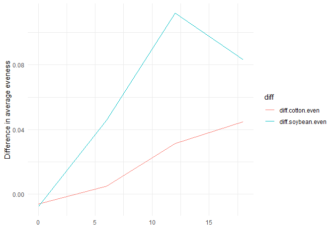

loading packages

``` r
library(tidyverse)
```

    ## ── Attaching core tidyverse packages ──────────────────────── tidyverse 2.0.0 ──
    ## ✔ dplyr     1.1.4     ✔ readr     2.1.5
    ## ✔ forcats   1.0.0     ✔ stringr   1.5.1
    ## ✔ ggplot2   3.5.1     ✔ tibble    3.2.1
    ## ✔ lubridate 1.9.3     ✔ tidyr     1.3.1
    ## ✔ purrr     1.0.2     
    ## ── Conflicts ────────────────────────────────────────── tidyverse_conflicts() ──
    ## ✖ dplyr::filter() masks stats::filter()
    ## ✖ dplyr::lag()    masks stats::lag()
    ## ℹ Use the conflicted package (<http://conflicted.r-lib.org/>) to force all conflicts to become errors

``` r
library(ggplot2)
```

1.- 3 pts. Download two .csv files from Canvas called DiversityData.csv
and Metadata.csv, and read them into R using relative file paths

``` r
Div.data<- read.csv("../data/DiversityData.csv")
Met.data<- read.csv("../data/Metadata.csv")
```

2.-4 pts. Join the two dataframes together by the common column ‘Code’.
Name the resulting dataframe alpha.

``` r
alpha<-full_join(Div.data,Met.data, by = "Code")
```

3.  4 pts. Calculate Pielou’s evenness index: Pielou’s evenness is an
    ecological parameter calculated by the Shannon diversity index
    (column Shannon) divided by the log of the richness column.

<!-- -->

1.  Using mutate, create a new column to calculate Pielou’s evenness
    index.
2.  Name the resulting dataframe alpha_even.

``` r
alpha_even<-mutate(alpha, Pi_index= (shannon/log(richness)))
```

4.  4.  Pts. Using tidyverse language of functions and the pipe, use the
        summarise function and tell me the mean and standard error
        evenness grouped by crop over time.

<!-- -->

1.  Start with the alpha_even dataframe
2.  Group the data: group the data by Crop and Time_Point.
3.  Summarize the data: Calculate the mean, count, standard deviation,
    and standard error for the even variable within each group.
4.  Name the resulting dataframe alpha_average

``` r
alpha_average<- alpha_even%>%
  group_by(Crop,Time_Point)%>%
  summarise(mean.pi=mean(Pi_index), n = n(), 
            sd.dev = sd(Pi_index),std.err = sd.dev/sqrt(n))
```

    ## `summarise()` has grouped output by 'Crop'. You can override using the
    ## `.groups` argument.

5.  4.  Pts. Calculate the difference between the soybean column, the
        soil column, and the difference between the cotton column and
        the soil column

<!-- -->

1.  Start with the alpha_average dataframe
2.  Select relevant columns: select the columns Time_Point, Crop, and
    mean.even.
3.  Reshape the data: Use the pivot_wider function to transform the data
    from long to wide format, creating new columns for each Crop with
    values from mean.even.
4.  Calculate differences: Create new columns named diff.cotton.even and
    diff.soybean.even by calculating the difference between Soil and
    Cotton, and Soil and Soybean, respectively.
5.  Name the resulting dataframe alpha_average2

``` r
alpha_average_2<- alpha_average%>%
  select(Time_Point,Crop,mean.pi)%>%
  pivot_wider(names_from = Crop, values_from = mean.pi)%>%
  mutate(diff.cotton.even= Soil - Cotton)%>%
  mutate(diff.soybean.even= Soil- Soybean)
```

6.  4 pts. Connecting it to plots

<!-- -->

1.  Start with the alpha_average2 dataframe
2.  Select relevant columns: select the columns Time_Point,
    diff.cotton.even, and diff.soybean.even.
3.  Reshape the data: Use the pivot_longer function to transform the
    data from wide to long format, creating a new column named diff that
    contains the values from diff.cotton.even and diff.soybean.even.
4.  This might be challenging, so I’ll give you a break. The code is
    below.
5.  Create the plot: Use ggplot and geom_line()with ‘Time_Point’ on the
    x-axis, the column ‘values’ on the y-axis, and different colors for
    each ‘diff’ category. The column named ‘values’ come from the
    pivot_longer. Theresulting plot should look like the one to the
    right.

``` r
alpha_average_2%>%
  select(Time_Point,diff.cotton.even,diff.soybean.even)%>%
  pivot_longer(c(diff.cotton.even, diff.soybean.even),
names_to = "diff")%>%
ggplot(aes(x = Time_Point, y = value, color= diff)) + # Plot it 
  geom_line() +
  theme_minimal() +
  xlab("") +
  ylab("Difference in average eveness")
```

<!-- -->
:)

7.  2 pts. Commit and push a gfm .md file to GitHub inside a directory
    called Coding Challenge 5. Provide me a link to your github written
    as a clickable link in your .pdf or .docx

[Here is our link to coding challenge 5
:)](https://github.com/Sol-Llerena/PLPA/blob/master/coding_challenge_5/coding_challenge_5.md)
